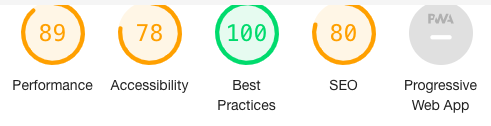
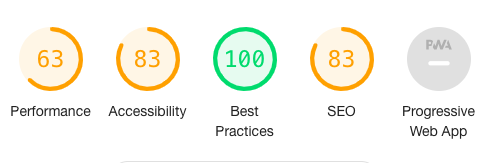
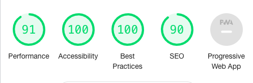
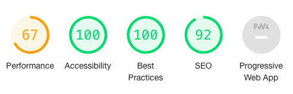

# Pontypridd Walking Society

View the [live project here](https://baileyl91.github.io/MS2_Pontypridd_Walking_Society/map.html)

This project was created as part of my Milestone Project 2 with Code Institute Web Application Development course. Decided to create a website for a made-up club called the ‘Pontypridd Walking Society’ and to demonstrate what I have learned in the course.

## User Experience (UX)

### User Stories

 - #### First time visitor goals:
    1. As a first time visitor, want to understand what is the website is for?
    2. As a first time visitor, want to see a gallery of photos of the different trails on offer
    3. As a first time visitor, want to find what options there are for walking in the area
    4. As a first time visitor, want to find information of the route 
    5. As a first time visitor, want to to chose a route base on the approx time it takes to complete
    6. As a first time visitor, want to visit the club social media pages
    7. As a first time visitor, want to find information on their weekly meet up
    8. As a first time visitor, want to be able to contact them with any queries a user may have

- #### Returning visitor goals:
    1. As a returning visitor, want to see if there any new photos added to gallery
    2. As a returning visitor, want to visit the club social media pages to see if there anything new
    3. As a returning visitor, want to find and explore other routes in the area
    4. As a returning visitor, want to find information of a new route of their chosen route
    5. As a returning visitor, want to check if there is a new route added to the map
    6. As a returning visitor, want to be able to contact them about any queries they may have
    7. As a returning visitor, want to be able to find information on their upcoming big walk meet up

### Design

**Color Scheme**

The main colours scheme for the website is a variety of different shades of green. Where the header and footer having the same colour while a brighter green for the background with white colour for the text. Decided on different shades of green to reflect the theme of the club, walking on trails in the mountains.

**Typograpghy**

The main font I have used is the ‘Poppins’ for its clean minimal look, with sans-serif as a back up option if there was any problem with using the main font.

**Imagery**

Have sourced a number of images to use for the website from Unsplash.A landscape of the countryside in Wales as the hero image with different images of the trails in Wales to be included in the planned gallery slideshow.

### Wireframes

* Home Page - [view](/assets/wireframes/home-page.png)
* Map Page - [view](/assets/wireframes/Map.png)

## Features

There are a number of features that have been implemented into the website which are:
* A top navigation bar to allow users to navigate the website.
* Footers to store social media links.
* Social Media links to connect users with the club social media pages.
* Responsive on all devices.
* A gallery slideshow of images of the trails
* A Google map of the local area
* Custom markers of where the trails are on Google Map
* An expanded text which include information of each route when selected

## Technology Used

**Language Used**

* HTML5
* CSS3
* JavaScript

**Frameworks, Libraries & Programs Used**

- [Google Font](https://fonts.google.com/)
    * The font 'Poppins' was imported from Google Font.
- [Font Awesome](https://fontawesome.com/)
    * Used Font Awesome to get some social media icons to use in footer.
- [Gitpod](https://www.gitpod.io/)
    * Gitpod is the development environment used to develop the project.
- [GitHub](https://github.com/)
    * GitHub is used to host project code.
- [Balsamiq](https://balsamiq.com/)
    * This program was used to create wireframes of the website.
- [Google Developer Chrome Tools](https://developers.google.com/web/tools/chrome-devtools)
    * The developer tools were used to inspect elements of the page and debug any potential problems within the website.
- [Unsplash](https://unsplash.com/)
    * This website was used to get stock free images for the project.

## Development

I have found the development of this project quite difficult as I had struggled with getting my head around some of the concepts of javaScript.
Relied a lot on the lessons provided by Code Institute and used W3C Schools to further understand the concepts along with their tutorials.  Also had a book called ‘javaScript and jQuery’ by John Duckett to read through to again understand some of the concepts. Overall I was not confident that I really understood JavaScript and about this project. 

Felt the need to simplify my project down to two web pages where broken down into four component for javaScript. The four component are:

1. A greeting
2. Gallery Slideshow
3. Google Map API with custom markers
4. Text box that expanded to reveal more information

**Future Development**

There were a number of things that I wanted to create as part of the website but unfortunately
due to difficulty I found durning the development, I had to cut out these features to make sure that I 
will be able to complete the project in time. 

Here are some of the features that I wanted to create.

1. A form contact page that allow the user to get in touch about any queries they had.
2. A meet up page where the club provide information their weekly meet up to allow the user to connect with like-minded people and to provide information on their next big walk/hike meet up.
3. Wanted to connect the Google Map with the expanded text box, where a user click on a custom marker that provide a name of the route with a link to more information on that particular route. If user clicks on ‘more info’, the link scrolls down to the expanded text box.

## Testing

The testing was done by me and tested the following questions:

* Are the navigation links working?
    Yes

* Does social media links work when clicked on a link and taken to a new tab/window?
    Yes

* When a user click on next in the gallery slideshow, does it shows the next image in line?
    Yes

* When a user clicks on previous arrow on the gallery slideshow, does it shows the previous image in line?
    Yes

* Does Google Map allows the user to interact with it using buttons such as zooming in?
    Yes

* When a user click on chosen walking route, does it expand to reveal more information about the route?
    Yes

* Does the greeting message display the correct message based on time of the day?
    Yes, I checked my site at 3 different times during the day. 
    At 10am it displays ‘Good Morning’.
    At 2pm it displays ‘Good Afternoon’.
    At 7pm it displays ‘Good Evening’.

The website have been tested in the following browsers to make sure it loading correctly and working:
* Chrome
* Safari
* Firefox

The website has tested on the following devices using Google Developer Tools, as I have only got access to iPhone 11.
* Samsung Galaxy S5
* Pixel 2
* iPad

### Lighthouse

Have tested the website using the Lighthouse via Google Developer Tools to test for its accessibility, SEO and best practice.

On desktop:


On Mobile:


During this first test, the feedback above in the screenshot it came back with an issue that my images did not have an alt attribute.Taking the feedback on board, I set out to add an alt attribute to all my images.
Below is the two screenshot of testing on both desktop and mobile after adding the improvement needed.It boost my scores well.

On desktop:


On Mobile:



### Issues

Throughout my development of the projects I had a couple of issues which I have tried to address.

One of the problem I had was that the javaScript code did not work for both two pages. Did not understand why however did solve the issue by assigning each page with it own javaScript page, i.e mapScript.js for map.html.

Secondly, the issue I had resolved around the expanded text box width. I had assigned the same width for the each section however when the user click on a route of their chosen, the expanded text then revealed. But it did not align with the header, create a longer width box. Was unable to solve the issue.

## Deployment 

### GitHub Pages

The project was deployed to GitHub Pages using the following steps

1.	Log in to GitHub and locate the GitHub Repository
2.	At the top of the Repository (not top of page), locate the "Settings" Button on the menu.
3.	Click on "Pages" in the left hand side menu.
4.	Under "Source", click the dropdown called "None" and select "Master Branch".
5.	The page will automatically refresh.
6.	The now published site link is now shown on top of page.

### Forking the GitHub Repository

By forking the GitHub Repository we make a copy of the original repository on our GitHub account to view and/or make changes
 without affecting the original repository by using the following steps.

1.	Log in to GitHub and locate the GitHub Repository
2.	At the top of the Repository (not top of page) just above the "Settings" Button on the menu, locate the "Fork" Button.
3.	You should now have a copy of the original repository in your GitHub account.

### Making a Local Clone

1.	Log in to GitHub and locate the GitHub Repository
2.	Below the settings, click on "Code".
3.	To clone the repository using HTTPS, under "Clone with HTTPS", copy the link.
4.	Open Git Bash
5.	Change the current working directory to the location where you want the cloned directory to be made.
6.	Type git clone, and then paste the URL you copied in Step 3.
7.	Press Enter. Your local clone will be created.

## Credits

### Code

Due to the difficulty I have found learning javaScript I have relied a lot on tutorials to help understand the concepts and what I wanted to develop for the site.

W3School Tutorial -  Gallery Slideshow

Wanted to implement a gallery slideshow where the user have control of looking through the images.Used the tutorial to learn and understand the javaScript behind the scenes. Here is the [tutorial page](https://www.w3schools.com/howto/howto_js_slideshow_gallery.asp) I used.

W3School Tutorial - Expanded Text Box

Wanted to develop an expanded text box that when a user clicks on a marker on the map, the hidden text will expand to reveal more information about the route.
Used the tutorial to learn and understand the javaScript behind the scenes. Here is the [tutorial page](https://www.w3schools.com/howto/howto_js_collapsible.asp) I used.

Google Map API Docs

I wanted to to learn how to use Google Map API and create a custom map for the website.
Used the API docs to learn to develop it for the site. Here the [link](https://developers.google.com/maps/documentation) to documentation I relied on.

### Content

All the content was written by me with help of the information provided online about each walking route via Google search.

### Media

All the stock images used were found on Unsplash

### Acknowledgements

Want to thank the Student Care and fellows students for the support. Also the tremendous community on the Slack channel.
